<div align="center">

<picture>
  <source media="(prefers-color-scheme: dark)" srcset="assets/banner-dark.svg">
  <source media="(prefers-color-scheme: light)" srcset="assets/banner-light.svg">
  
</picture>

<br>

[](https://tdpportfolio.vercel.app)
[](https://www.linkedin.com/in/tdp183/)
[](mailto:tranducphat1836@gmail.com)


</div>

---

### `>_ whoami`

I'm a **3rd-year IT student at UEH** bridging the gap between complex algorithms and real-world impact.

My focus sits at the intersection of **Data Engineering** and **Applied AI** — optimizing cloud databases, wiring Large Language Models into production-ready platforms, and leaning on AI-assisted workflows to build smarter and ship faster. I'm working toward a career in **AI Operations**: architecting resilient, intelligent systems that scale.

```yaml
name:        Tran Duc Phat
role:        IT Student @ University of Economics Ho Chi Minh City
focus:       [Applied AI, Data Engineering, Cloud-Native, AIOps]
currently:   Looking for an Applied AI internship
gpa:         3.71 / 4.0
motto:       "Architecting data systems and integrating AI to solve real problems."
```

<table>
<tr>
<td align="center"><b>3.71</b><br><sub>GPA / 4.0</sub></td>
<td align="center"><b>14</b><br><sub>Projects</sub></td>
<td align="center"><b>8</b><br><sub>Certificates</sub></td>
<td align="center"><b>1</b><br><sub>Research Award</sub></td>
<td align="center"><b>2</b><br><sub>Conference / Journal</sub></td>
</tr>
</table>

---

### `>_ cat focus.md`

<table>
<tr>
<td width="33%" valign="top">

**Applied AI & Data Engineering**

Orchestrating LLMs for automated workflows, deploying ML models, and engineering high-throughput streaming pipelines.

`Gemini` `LLaMA` `PyTorch` `Milvus` `Redpanda` `Pandas`

</td>
<td width="33%" valign="top">

**Cloud-Native & AIOps**

Infrastructure as Code, containerized environments, and reliability through continuous observability.

`Kubernetes` `Docker` `Terraform` `Ansible` `Prometheus` `Grafana`

</td>
<td width="33%" valign="top">

**Full-Stack Architecture**

Multi-tier systems, high-performance backends, and databases tuned down to the index level.

`FastAPI` `Node.js` `C#` `React` `PostgreSQL` `MySQL`

</td>
</tr>
</table>

---

### `>_ ls -la ~/featured`

| Project | What it does | Stack | Links |
|:--|:--|:--|:--|
| **FinXtract** | Accelerates financial statement analysis — upload a report, get structured data back. | `FastAPI` `Gemini 3.1` `Pandas` | [repo](https://github.com/tahpnart8/FinXtract) · [live](https://finxtract.vercel.app/) |
| **CloudCore Local** | Cloud-native e-commerce engine with real-time streaming and vector-based AI recommendations. | `Kubernetes` `Terraform` `Redpanda` `Milvus` | [repo](https://github.com/tahpnart8/CloudCore-Local) |
| **S-EduNet** | Adaptive Zero Trust architecture for Vietnamese school networks on legacy hardware. *Presented at DoSCI 2026.* | `Zero Trust` `OSPF` `VLAN` | [repo](https://github.com/tahpnart8/S-EduNet-Simulation) |
| **PT-BNN for MRI** | Brain tumor segmentation with Bayesian Neural Networks + Parallel Tempering for uncertainty quantification. *Prize C — UEH Student Awards 2025.* | `PyTorch` `MCMC` `U-Net` | [repo](https://github.com/Zile228/PT-BNN-for-MRI-Segmentation) |
| **Mekong Rice AI** | Climate-resilience tooling for Mekong Delta farmers, powered by Gemini + IoT sensors. *YDCC 2025.* | `Gemini 2.5` `IoT` `TypeScript` | [repo](https://github.com/tahpnart8/MekongRiceAI-YDCC2025NguLam) · [live](https://mekongriceai-ydcc2025.vercel.app/) |
| **Relioo** | Enterprise social network + Kanban task manager with AI-generated feeds. | `PHP` `MySQL` `MVC` `LLaMA 3.3` | [repo](https://github.com/tahpnart8/Nhom9-WebDev-EnterpriseSocialNetwork-Project) |

<details>
<summary><b>More work</b> — MedTag, SYNC, E-Wallet BST, and others</summary>

<br>

| Project | What it does | Stack |
|:--|:--|:--|
| [**MedTag**](https://github.com/tahpnart8/WDA2026-THEINSPO-MedTag) | Emergency medical information system — critical patient data available in seconds. *WebDev Adventure 2026.* | `TypeScript` `React` |
| [**SYNC**](https://github.com/tahpnart8/TCXD_QuanLyCongTac_Sync) | 3-tier desktop app streamlining Youth Union organizational workflows. | `C#` `WinForms` `JSON` |
| [**E-Wallet BST**](https://github.com/tahpnart8/CTDLGT_DE8_BinarySearchTree_IT0001) | E-wallet profile management on a hand-rolled Binary Search Tree. | `C#` `.NET` `DSA` |
| [**Nha Ba Teria**](https://github.com/tahpnart8/demo-pttkht-Nhom2IT0001) | POS + internal ERP system for a real café. | `JavaScript` `Supabase` |

Full case studies with architecture diagrams and results live on **[tdpportfolio.vercel.app](https://tdpportfolio.vercel.app)**.

</details>

---

### `>_ tech --stack`

**Languages**


**AI & Data**


**Backend & Data Stores**


**Cloud & Ops**


**Frontend**


---

### `>_ git log --stat`

<div align="center">


<br>


</div>

---

### `>_ ./snake --eat-contributions`

<div align="center">

<picture>
  <source media="(prefers-color-scheme: dark)" srcset="https://raw.githubusercontent.com/tahpnart8/tahpnart8/output/github-snake-dark.svg">
  <source media="(prefers-color-scheme: light)" srcset="https://raw.githubusercontent.com/tahpnart8/tahpnart8/output/github-snake.svg">
  
</picture>

</div>

---

<details>
<summary><code>>_ cat education.txt</code></summary>

<br>

**University of Economics Ho Chi Minh City (UEH)** — *2024 – 2028*
BSc Information Technology · **GPA 3.71 / 4.0**

Core coursework: Data Structures & Algorithms · Object-Oriented Programming · Web Application Development · Database Administration · RDBMS & NoSQL · Analysis and Design of Information Systems

**Quoc Hoc Quy Nhon High School** — *2021 – 2024*
Mathematics · Physics · Chemistry

</details>

<details>
<summary><code>>_ ls certificates/</code></summary>

<br>

| Credential | Issuer | Year |
|:--|:--|:--|
| **Prize C — CTD Scholar Award 2025** *(student scientific research)* | UEH | 2026 |
| **DoSCI 2026 Conference Presentation** | DoSCI | 2026 |
| Python Essentials 1 & 2 | Cisco Networking Academy | 2026 |
| WebDev Adventure 2026 — Participant | WDA | 2026 |
| Youth Digital Citizen Challenge 2025 — Participant | YDCC | 2026 |
| Official Member Certificate | English Talent Club | 2025 |
| MEECONNECT Field Trip & Career Orientation | MEECONNECT | 2024 |

Verifiable copies: **[tdpportfolio.vercel.app/#certificates](https://tdpportfolio.vercel.app/#certificates)**

</details>

<details>
<summary><code>>_ cat now.md</code></summary>

<br>

- **Looking for** an Applied AI internship where I can go deeper on data pipelines, small language models, and agent workflows.
- **Building** portfolio v2 — React 19 + Vite, dark mode, command palette, zero-backend CMS.
- **Learning** Kubernetes operators, vector search at scale, and evaluation for LLM systems.
- **Long game** — AI Operations Engineer, architecting intelligent systems that stay reliable under load.

</details>

---

<div align="center">

### `>_ contact --now`

Always happy to talk about data systems, LLM workflows, or a project you have in mind.

[](https://tdpportfolio.vercel.app)
[](https://www.linkedin.com/in/tdp183/)
[](mailto:tranducphat1836@gmail.com)

<sub><code>>_</code> Thanks for scrolling this far.</sub>

</div>
